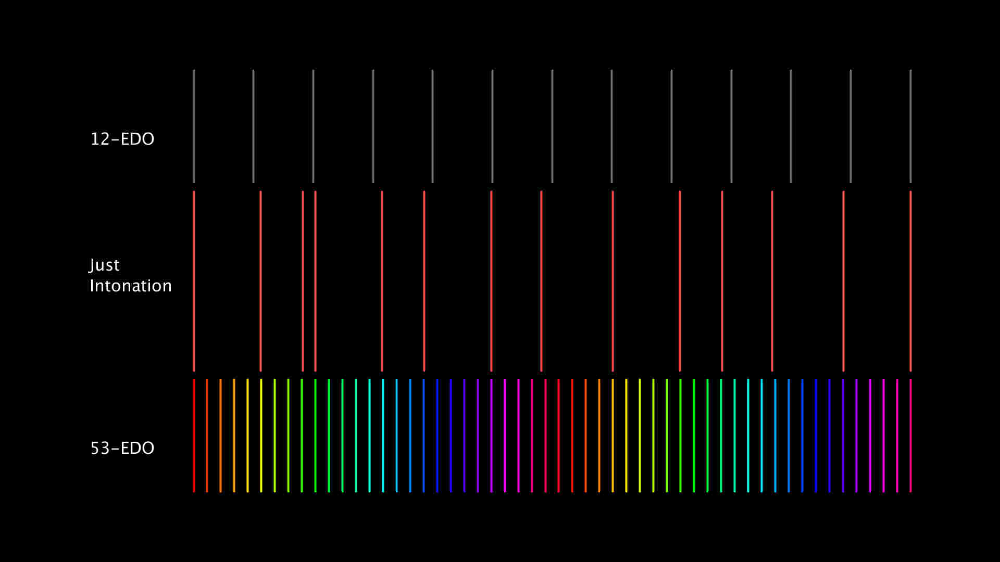

Do you feel trapped by the oppressive limitations of the 12-note chromatic scale? Do the thirds and fifths on your piano make you itch (let's not even talk about the sevenths)? Have you tried every chord on the piano and not found one you like? Then read on!

===

> Looking for musical examples? There are some tunes at the very bottom!

## What even is a temperament?

A temperament is a musical tuning system other than the holy grail and forbidden fruit of pitch based music: just intonation. One where intervals are altered from their just ratios to tame them and put them into keyboards.

Imagine for a second that you live in the 500s BC in Greece and you have a keen interest in music and other branches of mathematics. Your name is Pythagoras. You realise that by mounting a string on top of a ruler you can mathematically divide the string into different parts (some people would call it a monochord). Obviously, the fifth is the greatest of all intervals, so wonderfully consonant and easy to tune, and now you can add the fifths one after another on top of eachother and play using only the purest of fifths. To your dismay you realise that the major third arrived at by adding up four of your beloved fifths is extremely sharp. Better not use that interval then, it can't be that great if you can't reach it by fifths anyways. Worse yet, the 12 fifths on top of each other reach a note just slightly sharp from 7 octaves, giving rise to your most well known discovery: the Pythagorean comma.

> I've recreated Pythagoras' stacking for you, listen to the fifths, then the octaves, and then just the last notes in either stack:  
> 
> 
> These are the very bright and very sharp Pythagorean thirds:   
> Compare them to these perfectly just thirds: 

Now, imagine that you are in fact not Pythagoras, but instead a simple musician in the early 16th century. You begin to think that these fifths are a bit worn out, and to be honest pretty overrated. But look at these shiny heavenly thirds, wouldn't it be much better if we could play those on our clavichords? So you start retuning the strings of your old instrument. Starting at C you tune four fifths up, but flatten each fifth by 1/4th of the difference between the gastly Pythagorean major thirds and the wonderful Pure ones (and you decide to give this comma interval at least five different names to confuse future music students: syntonic comma, chromatic diesis, Didymous comma, Ptolemaic comma or diatonic comma). You reach an E... and it's lovely, a perfect justly intonated major third. Granted, the fifths are now very flat, but who cares?

> Some piano chords in 1/4 comma meantone:  
> 

Turns out some people do care about fifths and a vicious war began between the Pythagoreans and the Meantonians. Waging back and forth for hundreds of years, a compromise started to make ground: 12-tone equal temperament. It was a compromise that heavily favoured the fifths, being only 2 cents flat, while the thirds are almost as sharp as the Pythagorean one, but it allowed us to keep the same keyboard layout and fit nicely with Western music theory. The easiest way to produce 12-tone equal temperament is by chopping the octave into 12 equal parts (much harder than it seems), which incidentally is the exact same thing as flattening each fifth by 1/12th of the Pythagorean comma. The temperament is equal because every step is the exact same size. By the 20th century, 12-tone equal temperament completely dominated Western keyboard instruments. This temperament has powered atonal music and jazz harmony and has become so ubiquitous that many musicians never consider its implications.

N.B. The simplified explanation above has been embellished with a speck of fiction.

## The forbidden fruit

Just intonation is based on the harmonic series, the physical phenomenon that occurs with many musical sounds in the real world such as vibrating strings. Whenever a string vibrates, it vibrates not only at the length of the whole string, but also at subdivisions of it at different amplitudes. As a simple thought experiment, imagine you and some friends go into a field with a long string. It has to be a string with a diameter of 5 mm and a density of 1 kg/m3. Cut it to 112.8 m, tension it to 1 N and pluck it and you wil see a 1Hz wave travelling through the string. You will also see the 2, 3, 4, 5, 6, 7, 8 etc. Hz waves at different amplitudes, called harmonics. All the primes in this series (which theoretically goes on forever) represent a new pitch that is not an octave of a previous pitch in the series. The 3rd harmonic for example is the fifth and the 5th harmonic is the third (confusing, I know). Bringing the 5th harmonic down into the same octave as the fundamental (by dividing it by 4) gives us the ratio for a just major third 5:4.

I know what you're thinking, this all seems very straight forward. Why wouldn't everyone just use just intonation and call it a day? Well, because every pitch produces its own overtone series. Say you use just intonation to derive your optimal C major scale (e.g. using the ratios 1, 9:8, 5:4, 4:3, 3:2, 5:3, 15:8 and 2). You can now play music over a C drone, which isn't so bad. But just to prove my point, let's say you grow tired of C and want to use F as a drone? Well, in that case you have to add just intervals in relation to F. You can see how this idea means good business for piano tuners and string manufacturers! 

## Other equal temperaments

The octave is a doubling of frequency. To produce the interval between pitches in 12-tone equal temperament you make them the ratio of the twelfth root of 2 or 2^(1/12). While this used to be really hard, my elementary school maths teacher has been proven wrong and everyone walks around with calculators in their pockets. That means you can easily divide the octave into a different number of parts, which have different exciting properties. To avoid all confusion, nowadays the term Equal Division of the Octave (EDO) is preferred to equal temperament. In addition to 12-EDO there is for example 19-EDO, 22-EDO and 31-EDO with their own special characteristics, but I've become most interested in 53-EDO.

## Why on earth would you need 53 notes per octave?

I have to admit, it's not the most straightforward tuning system to use. It is difficult to notate and it requires a whole lot of keys to make a keyboard out of it. Most combinations of pitches are very dissonant; in fact, you can obtain dissonances that the followers of 12-EDO can only dream of. But it has a few neat features: the purest fifths of any low number EDO, almost just thirds, a pretty good approximation of 5-limit just intonation and an okay approximation of 7-limit just intonation.

> The first chord in each of these examples is in 12-EDO and the second chord is the 53-EDO equivalent:  
> Major chord:   
> Seventh chord:   
> Minor seventh chord:   
> Thirds up and down:   
> 
> This cadence is repeated a few times to allow you to adjust your ears to the temperament:  
> Cadence in 12-EDO:   
> Cadence in 53-EDO:   

One step in 53-EDO is 22.642 cents, almost precisely in between the syntonic comma (i.e. the difference between a Pythagorean and a just major third) at 21.51 cents and the Pythagorean comma at 23.46 cents. Many EDOs (e.g. 12-EDO, 19-EDO, 31-EDO etc.) temper out the syntonic comma resulting in enharmonic equivalence, but the 53-EDO does not. This way, both the Pythagoreans and the Meantoneians get their way with almost completely just major thirds and pure fifths, and even Pythagorean major thirds if you want. This also results in the same kind of drift of root notes as that which happens using pure just intonation (as demonstrated in [this great video by Early Music Sources](https://www.youtube.com/watch?v=XhY_7LT8eTw)), but better. To summarise the phenomenon, if a just _major_ third, which is one comma lower than a Pythagorean major third, is used as the root for the subsequent chord that whole chord will be one comma level lower than the starting chord. Read that sentence again, just to be sure. In the same way, using a just _minor_ third as the new root will result in a chord one comma higher. The drift each time in 53-EDO is exactly 1/53 of an octave meaning that if a piece of music is drifting 53 commas in the same direction it will arrive at the octave above or below. This is different from the pure syntonic comma which does not add up to an octave, leaving you forever drifting in empty JI space. 

This is what is called a _comma pump_. According to [the Xenharmonic Wiki](https://en.xen.wiki/w/Comma_pump), a comma pump occurs when, in a chord progression, the root (i.e. the note on which the harmony is based) is shifted by a comma. This will result in a falling or rising unless that comma is tempered out. Comma pumps in this definition using a tempered comma (resulting in enharmonic equivalence) are therefore very common in 12-EDO. Using chord progressions that are comma pumps of the syntonic comma will therefore have very different effects in 12-EDO and 53-EDO.

> A comma pump that is stable in 12-EDO (first) and rising 1 comma in 53-EDO (second) (Dm F C Gm Gm Dm):  
>   
> _The 53-EDO version repeats the first and last chord to demonstrate the difference._

To use one of these progressions in 53-EDO without any comma drift you can either "move the comma back" i.e. adjust the third one comma up or down when progressing to the next chord, or juxtapose the progression with another progression that drifts back in the opposite direction.

> A different comma pump, falling 1 comma in 53-EDO (C F Dm G G7 C):  
> 12-EDO:   
> 53-EDO:   
> 53-EDO compensated at Dm:   
> 53-EDO compensated at G:   
> _The last two recordings bring the chords back up to the starting comma level at the Dm or the G chord respectively._

In 53-EDO, comma drift is therefore possible as a means of modulation. Rising 9 commas for example will result in a modulation one major tone up.

Because 53-EDO preserves the Pythagorean comma (and merges it with the syntonic comma), the difference between 12 fifths and 7 octaves that is present in Pythagorean tuning is also preserved in 53-EDO. 12 fifths = 372 steps and 7 octaves = 371 steps. A long progression of fifths will therefore not bring you back to your starting note. It will, however, not bring you into complete wilderness either as the 53-EDO grid can guide you back home whenever you want.

## But can you make music with it?

That's what we're gonna have to find out! When creating digital musical instruments or composing with computers, some of the difficulties of having so many notes per octave can be abstracted away. 

Examples on the internet are scarce (or maybe I just don't know where to look), but here are a few tunes I've been able to find:
- [Sevish - Droplet](https://www.youtube.com/watch?v=xVZy9GUeMqY)
- [Pure Data algorithmic composition in 53-EDO (with visualization)](https://www.youtube.com/watch?v=_63Cc6vPFVI)
- [I Think I'm Lost. (53 EDO)](https://www.youtube.com/watch?v=_l0ogOu5Jfo)
- [Taking Flight (53edo Microtonal Orchestral Music)](https://www.youtube.com/watch?v=sIsfYQATouc)

#### Update 2021-09-17
The sound diary of the first 8 months with my 53edo instrument contains only music in 53edo: [https://eriknatanael.bandcamp.com/album/neod-1-anortosit](https://eriknatanael.bandcamp.com/album/neod-1-anortosit)

<iframe style="border: 0; width: 350px; height: 654px;" src="https://bandcamp.com/EmbeddedPlayer/album=493166283/size=large/bgcol=ffffff/linkcol=0687f5/transparent=true/" seamless><a href="https://eriknatanael.bandcamp.com/album/neod-1-anortosit">neod.1.anortosit by Erik Natanael</a></iframe>
