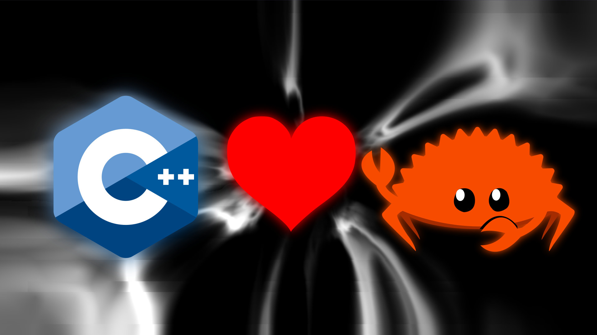

Want to use some of your Rust code in a Bela project, but don't know how to get all the bits to talk to each other? Neither did I, so I figured it out and wrote it down so you don't have to. And to save my future self from the frustration of figuring it all out again.

===

This post will go through setting up the toolchain to compile a Rust library for the Beaglebone Black, how to write your Rust library so that it can interface with the C++ code of your existing Bela project and how to get it onto the Bela and run it in a project. It is not meant as an exhaustive resource on any of these subjects, just a series of pointers to get you moving in the right direction.



I owe this knowledge to the excellent writers of blog posts, forum posts and project documentations that explain these topics in much more depth. Some of these sources are listed below:

- [https://michael-f-bryan.github.io/rust-ffi-guide/print.html](https://michael-f-bryan.github.io/rust-ffi-guide/print.html)
- [https://github.com/eqrion/cbindgen/blob/master/docs.md](https://github.com/eqrion/cbindgen/blob/master/docs.md)
- [https://rust-lang.github.io/libc/](https://rust-lang.github.io/libc/)
- [https://doc.rust-lang.org/book/ch19-01-unsafe-rust.html#using-extern-functions-to-call-external-code](https://doc.rust-lang.org/book/ch19-01-unsafe-rust.html#using-extern-functions-to-call-external-code)
- [https://doc.rust-lang.org/stable/std/slice/fn.from_raw_parts.html](https://doc.rust-lang.org/stable/std/slice/fn.from_raw_parts.html)
- [https://electric-snow.net/2021/08/26/rust-heart-bela-setting-up-cargo-for-cross-compilation/](https://electric-snow.net/2021/08/26/rust-heart-bela-setting-up-cargo-for-cross-compilation/)

If you have no need for any C++ nonsense (e.g. peripheral libraries) you can use one of the Rust wrappers for the core Bela library e.g.:
- [https://github.com/l0calh05t/bela-rs/tree/next](https://github.com/l0calh05t/bela-rs/tree/next)

## How to generate a C compatible library from Rust

To use Rust code from C it needs to be built into a static library compatible with C, and the C compiler needs a header file to know what stuff is available in the static library. That means a `.a` and a `.h` file.


### Set up Cargo to generate a shared library compatible with the C ABI

Make sure there is an entry in Cargo.toml looking something like
```toml
[lib]
name = "libneod-rs"
path = "src/lib.rs"
crate-type = ["staticlib"]
```

All functions that shall be available from C need `pub extern "C"` before the `fn` and `#[no_mangle]` on the preceeding line.

The easiest way to set up cbindgen IMHO is to create a build.rs file in the root of the crate containing the following:

```rust
extern crate cbindgen;

use std::env;

fn main() {
    let crate_dir = env::var("CARGO_MANIFEST_DIR").unwrap();

    cbindgen::Builder::new()
      .with_crate(crate_dir)
      .with_language(cbindgen::Language::Cxx) // possible values: C, Cxx, Cython
      .generate()
      .expect("Unable to generate bindings")
      .write_to_file("bindings.h");
}
```

cbindgen also needs to be added as a build dependency in Cargo.toml:
```toml
[build-dependencies]
cbindgen = "^0.19.0"
```

Note: A C style header in C++ code will lead to linker errors. Use the `Cxx` language option for cbindgen or wrap the header in an `extern "C" {}` block to avoid spending a day on this (time usage confirmed empirically).

### Generate code for the Bela CPU

The Bela runs on a BeagleBone Black which uses an arm CPU. To generate the library for that architecture we need to install it as a target:
```
rustup target add armv7-unknown-linux-gnueabihf
rustup toolchain install stable-armv7-unknown-linux-gnueabihf
```
I am unsure if the second line is actually required, but it was suggested somewhere.

Also, place the following two lines in `.cargo/config`:
```toml
[target.armv7-unknown-linux-gnueabihf]
linker = "arm-linux-gnueabihf-gcc"
rustflags = ["-Ctarget-cpu=cortex-a8", "-Ctarget-feature=+neon"]
```
The rustflags were suggested in [a blog post ](https://electric-snow.net/2021/08/26/rust-heart-bela-setting-up-cargo-for-cross-compilation/) to unlock some optimisations. You can also add the following to the same file if you'll only be building this library for the BeagleBone:
```toml
[build]
target = "armv7-unknown-linux-gnueabihf"
```

### Constructing an oblique pointer API

We don't want the C++ code to care about or have access to the internals of the Rust struct containing all of the Rust state so we will create a raw pointer to a struct, which must be on the heap, and return it to the C++ code. This means that the memory that the pointer points to has to be manually dropped when not needed by the C++ code.

To create the pointer:
``` rust
/// Creates an opaque pointer to the SynthesisInterface
///
/// # Safety
/// Make sure you destroy the SynthesisInterface with `destroy_synthesis_interaface`
/// once you are done with it.
#[no_mangle]
pub unsafe extern "C" fn synthesis_interaface_create(
    sample_rate: libc::c_float,
) -> *mut SynthesisInterface {
    Box::into_raw(Box::new(SynthesisInterface::new(sample_rate as f32)))
}
```

To drop the memory:

``` rust
/// Drops the SynthesisInterface from C
/// # Safety
/// This will drop a SynthesisInterface if the pointer is not null. Don't give it anything
/// other than a pointer to a SynthesisInterface gotten from `create_synthesis_interaface`.
#[no_mangle]
pub unsafe extern "C" fn synthesis_interaface_destroy(
    synthesis_interface_ptr: *mut SynthesisInterface,
) {
    if !synthesis_interface_ptr.is_null() {
        drop(Box::from_raw(synthesis_interface_ptr));
    }
}
```

Using the pointer is quite easy. By dereferencing and then immediately borrowing `&*ptr` or mutably borrowing `&mut *ptr` we can use the reference like normal in Rust.

``` rust
#[no_mangle]
pub unsafe extern "C" fn synthesis_interaface_process(
    synthesis_interface_ptr: *mut SynthesisInterface,
    num_frames: libc::size_t,
) {
    if synthesis_interface_ptr.is_null() {
        eprintln!("Error: null pointer in synthesis_interaface_process");
        return;
    }
    (&mut *synthesis_interface_ptr).process(num_frames as usize);
}

```

### Generating the static library and header file

With the build.rs setup, all that's needed is to run `cargo build --target=armv7-unknown-linux-gnueabihf --release` to generate both the header file and the shared library. The header file will be in the path specified in build.rs and the library will be in `target/release/`, both relative to the root.

## How to run the Rust library on Bela

### 1. Include the header file in the bela project code.
This is as simple as `#include "bindings.h"` if the `bindings.h` file is in the root. 

### 2. Change the settings to link to a shared library.

This can be done through the web GUI in Settings->Make Parameters, or by modifying `settings.json` where the same entry is `"make": ""`
The relevant parameters are `LDFLAGS` for setting where the linker should look for your library, and `LDLIBS` for setting what libraries to link to:
```
LDFLAGS=-L/root/LIBRARYNAME/build/lib;
```


```
LDLIBS=-lneodrs;
```
If the library file is called `libneodrs.a`, the flag should be `-lneodrs` since the `lib` prefix and the extension are added automatically. If you're using libc for C types, you also need to link to `-ldl`.

```
RELINK=1;
```
RELINK will force a relinking against libraries every time. This makes sure the linker will always link to the current version of the Rust library.


Note that each parameter is ended by a semicolon. Also note that the last parameter should not end in a semicolon, or you will not be able to set the project to boot automatically until that bug is fixed (see [https://github.com/BelaPlatform/Bela/issues/641](https://github.com/BelaPlatform/Bela/issues/641)).

### 3. Compile and run the code on the Bela. 

I prefer using the Bela scripts. Clone the Bela git repo, go to `Bela/scripts/`. The `build_project.sh` script will transfer your project to the Bela and compile it on the board. You can pass build options through the `-m` argument. For my project, called Neod, using the Rust library called neodrs, the full command to transfer, compile and link it is:
```
$ yes | ./build_project.sh ~/Dokument/Neod/code/Neod -m "LDFLAGS=-L/root/Bela/projects/Neod/libraries/ LDLIBS=\"-ldl -lneodrs\" RELINK=1"
```
This will overwrite the existing project without verification (because of `yes`).

Note that in order to pass multiple libraries to the LDLIBS argument, escaped quotation marks are needed.

## Performance

The first version of my Bela sound synthesis library in Rust was designed to do the exact same thing as the original C++.
The Bela IDE reports CPU usage with this library at 65-67%, whereas the original C++ has a reported CPU usage at 73-85%. 
While this is all very anecdotal and unscientific, the FFI between C++ and Rust doesn't seem to have slowed things down. There is certainly room for optimization in both the old and the new code bases.

The time to build the version using the Rust library is significantly longer, due to the linking stage needing to be redone for every change. Maybe it's possible to only force one library to be relinked, please get in touch if you know how to do it!

## Support

If you want to support my musical experiments, please consider buying my music on bandcamp:
[https://eriknatanael.bandcamp.com](https://eriknatanael.bandcamp.com)
